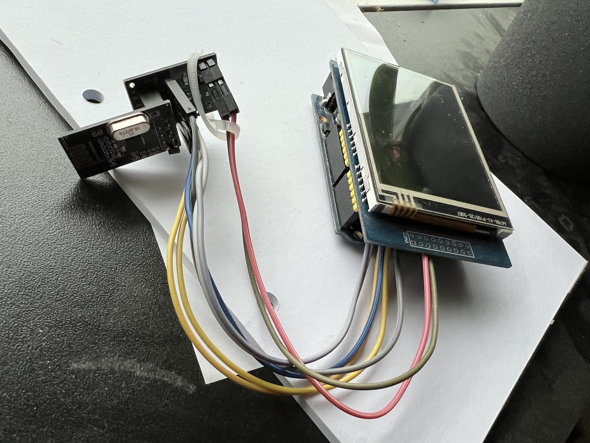
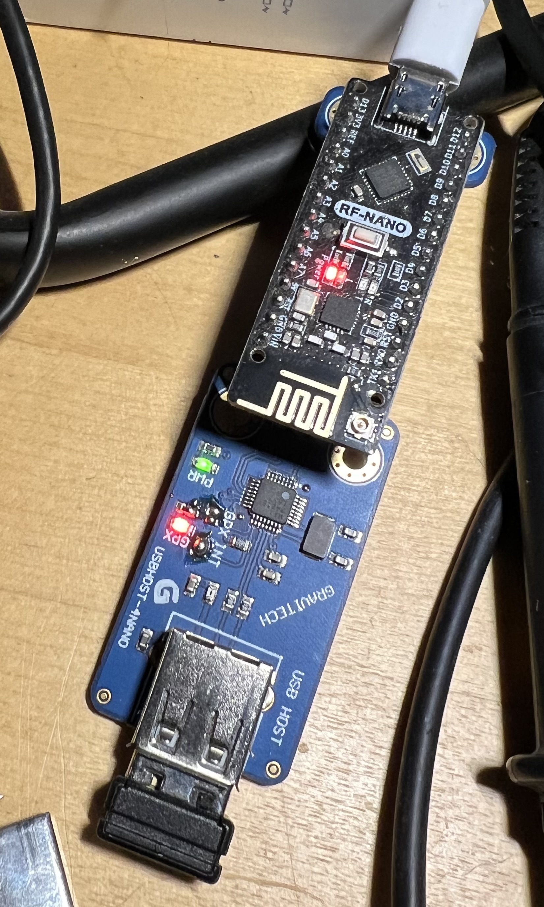

# CWComfort, a morse keyer with lazy attitude
### My morse keyer, the one without timing hassels
### By Christen Fihl, [OZ1AAB](https://www.fihl.net/oz1aab/)

[CWComfort, my morse keyer software, one with a lazy attitude](/cw/)

## So far
* ComfortTXusbhost is a controller, having one input (an USB connected keyboard), and one output (BLE to ComfortTX). Myself I do use a wireless USB keyboard, now we already are "wireless"
* ComfortTX is a generic CW keyer, controlled via BLE commands. 
* Arduino code is [here](https://github.com/Fihl/BLE_CW_Keyer)

## Picts
### ComfortTX, the BLE receiver with keying circuit

### Arduino DUE part, having the USB host for USB keyboard. 
And BLE sending to ComfortTX

### Room with a view

