# How to make a WEB page (100% free of charge) by Christen Fihl 

11 
22 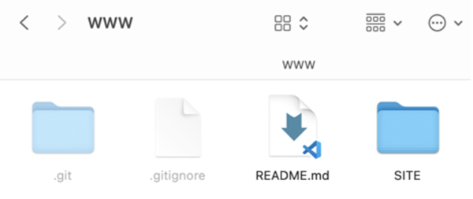

DigitalOcean now has a new feature, App’s, and for this use, static pages on demand. 

This page is written, using Microsoft Word, but anything goes as an editor. 

index.html could be as simple as just containing
Hello World

## How it’s made…

### On github do: 
*	You will need a github.com account, and a repo in there; let’s call it WWW
*	To have a readme and other stuff at hand, I create the real site inside a folder SITE

* Inside SITE you have your read web page, with index.html etc. 

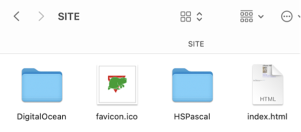

As of now, I am now editing file git/WWW/SITE/DigitalOcean/index.md, that is, I am using MSCode for the edit, see the raw file **[here](index.md)**
My index.html is created from the md one, by the Markdown All in One plugin (press F1, and type **print**)
* Commit it all to github (index.md not needed, but I just do anyway)

### Now on DigitalOcean do:

* Get yourself a free account, like using my referral link: [DigitalOcean](https://m.do.co/c/a01c93af1655) (you and Christen gets some $$)
* Goto Apps(NEW), and use Create – Apps 

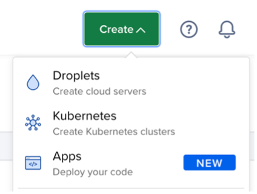

* In 4 steps you just accept most as default, except tell that site is not in / but in /SITE
* Select repository

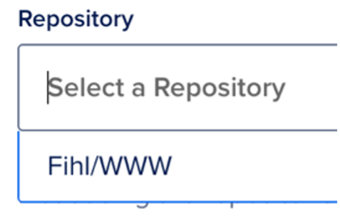

* Before that, you need (once only) to say yes to allow DigitalOcean access to your github repo!
* Next!
* If you do see red warning, there is no index.html in the selected repo. Try again..

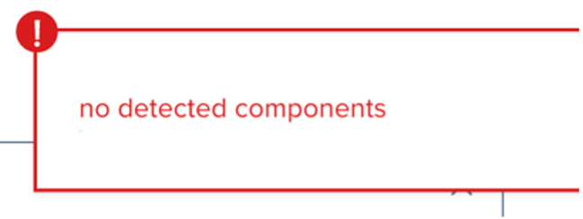

* Then manually type SITE to have /SITE

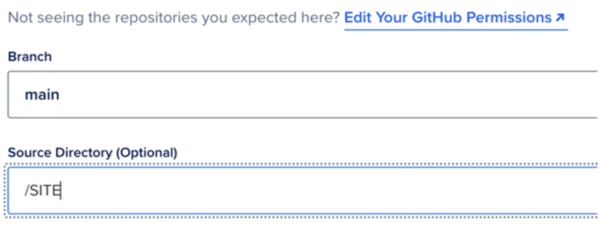

* Do keep the Autodeploy option enabled

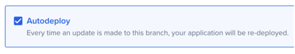

* Next!
* Next!
* Next, until deploying, and then your site is online
* Online in some strange url
* Go try it out there
* Mine looks like:

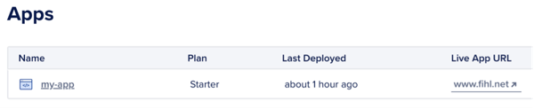

* And my Live App URL is at [www.fihl.net](https://www.fihl.net/)

### Using your own URL, this is How it’s made…
* Goto your App, and press Settings, and do edit Domains

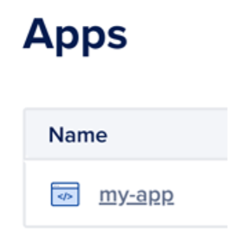

* Select DIY version of DNS (or use DigitalOcean if you like)

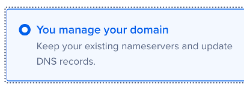

* Copy the strange URL pressing the Copy button

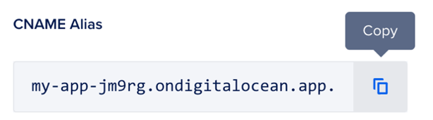

* Goto your DNS account, and add a CNAME for your domain, using the copied alias:

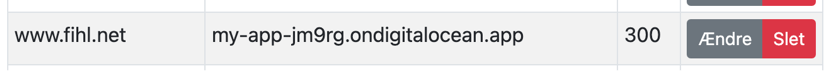

## And that is how you can now read this page on address  [https://www.fihl.net/DigitalOcean/](https://www.fihl.net/DigitalOcean/)

The magic is now that whenever you do change your file locally, and push it to github, then the webpage is recreated on the fly, with no downtime, in a minutes time

## And it is all free of charge, using
* Microsoft Visual Studio Code
* CheatCheet https://www.markdownguide.org/cheat-sheet
* [Markdown All in One by Yu Zhang](https://marketplace.visualstudio.com/items?itemName=yzhang.markdown-all-in-one)

