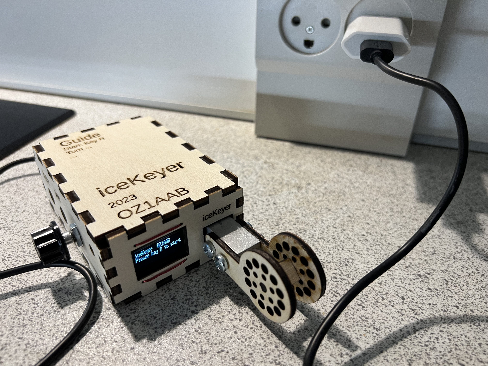
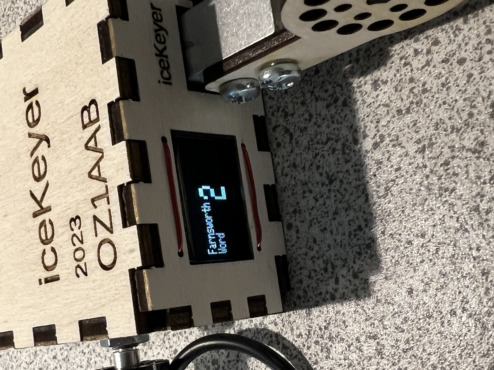

# iceKeyer, the no fuss keyer. Single-Lever model

## Features
- No moving parts
- Needed pressure are automatically calculated, by how you use it
- No adjustment
- No more bad contacts, no wetting problems
- No noise/click
- Family frendly at late nights
- Room for magnets on bottom, or fixed to solid metal
- No Jambic, as only 1 paddle
- I do use my own [CWComfort](https://www.fihl.net/cw/) [older pictures](https://www.fihl.net/CWComfort/) 
  - where you can keep keying using your own speed, and transmit on a lower speed. 
  - Farnsworth spacing both on words and on single letters
- Easy access to memory entry/transmit

## The electronics
- ESP32 (Like [LOLIN S2 mini](https://www.aliexpress.com/item/1005004912486444.html))
- ESP32 (Or [C3 Super Mini](https://www.aliexpress.com/item/1005006391993583.html))
- [SSD1306 display](https://www.aliexpress.com/item/1005003660103053.html)
- Load cell weight element with [amplifier HX711](https://www.aliexpress.com/item/1005005990833147.html) 
  - HX711 has to be changed for 80 samplings/second

## Box laser cutting
I do export dxf files right out of OpenSCAD. 
And the text is exported in svg file 
See the box folder on GitHub  
[Look inside box folder](https://github.com/Fihl/iceKeyer)  

## The code
[Look inside src folder](https://github.com/Fihl/iceKeyer)

## Feedback
[Please join the facebook group iceKeyer](https://www.facebook.com/groups/oz1aab)
