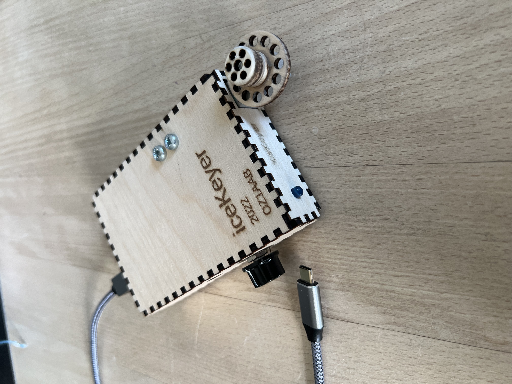
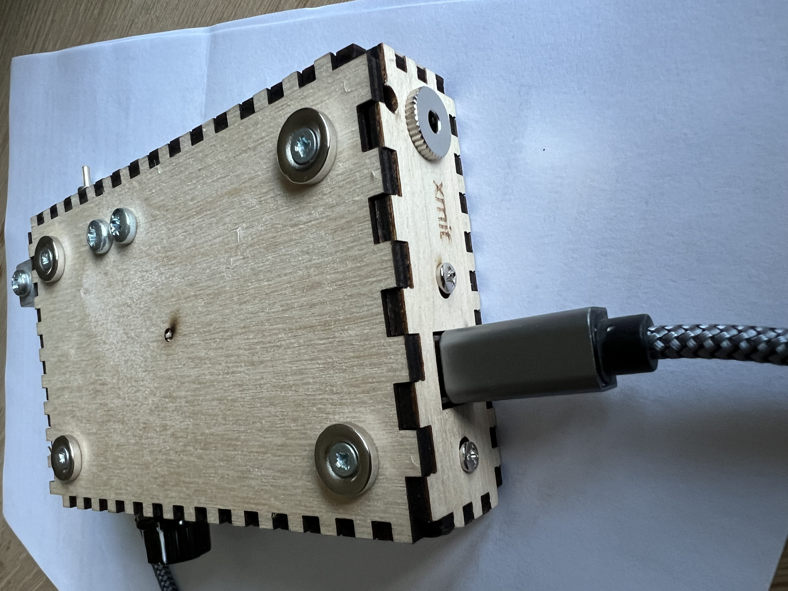
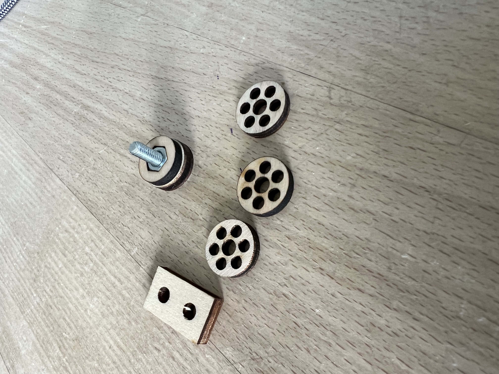
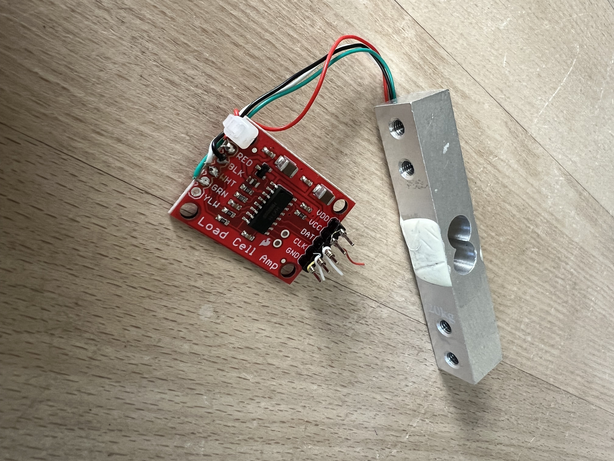
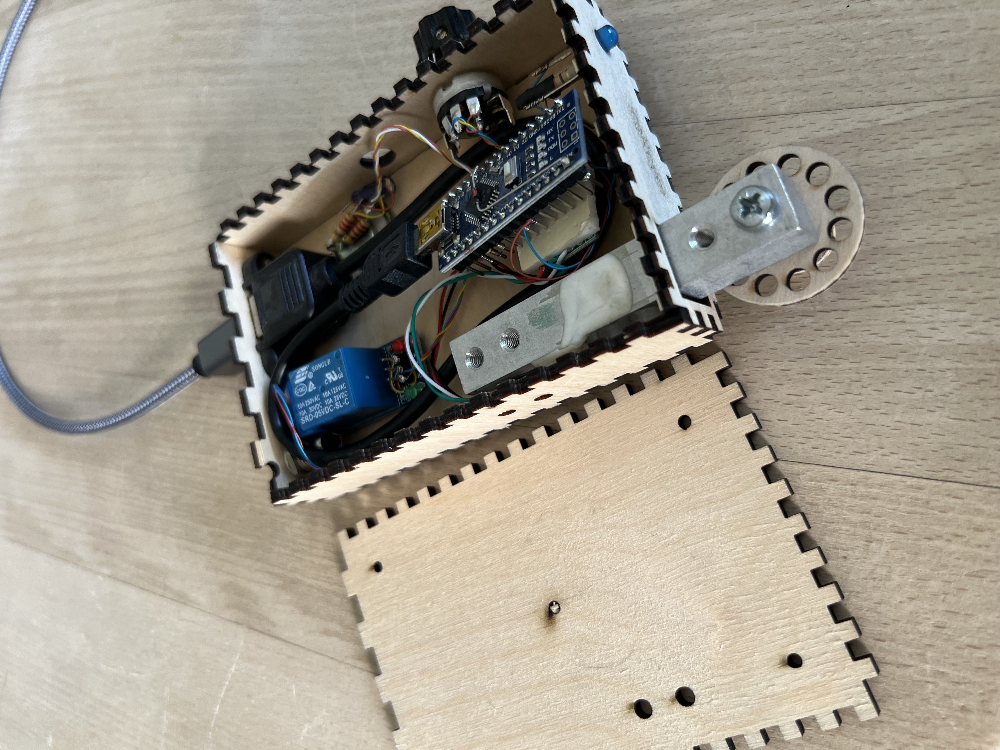

# iceKeyer, the no fuss keyer. Straight model

## Features
- No moving parts
- Key pressure are automatically calculated
- No adjustment
- No more bad contacts, no wetting problems
- No noise/click
- Family frendly at late nights
- Room for magnets on bottom, or fixed to solid metal
- Can work in raw mode, passing exact what is keyed
- Or the code can generate exact timing based on +/- 20% bad keying

## The electronics
- A plain Arduino Nano is used
- Load cell weight element with [amplifier HX711](https://www.aliexpress.com/item/1005005990833147.html) 
  - HX711 has to be changed for 80 samplings/second
- Alternative, for an old style key, one can be made out of a single [body weight element](https://www.aliexpress.com/item/1005003760719720.html), when getting a new scale in the bathroom.

## Box laser cutting
I do export dxf files right out of OpenSCAD. 
And the text is exported in svg file 
See the box folder on GitHub  
[iceKeyer github](https://github.com/Fihl/iceKeyer)  

## The code
Stay tuned, to get the code later right here on github
